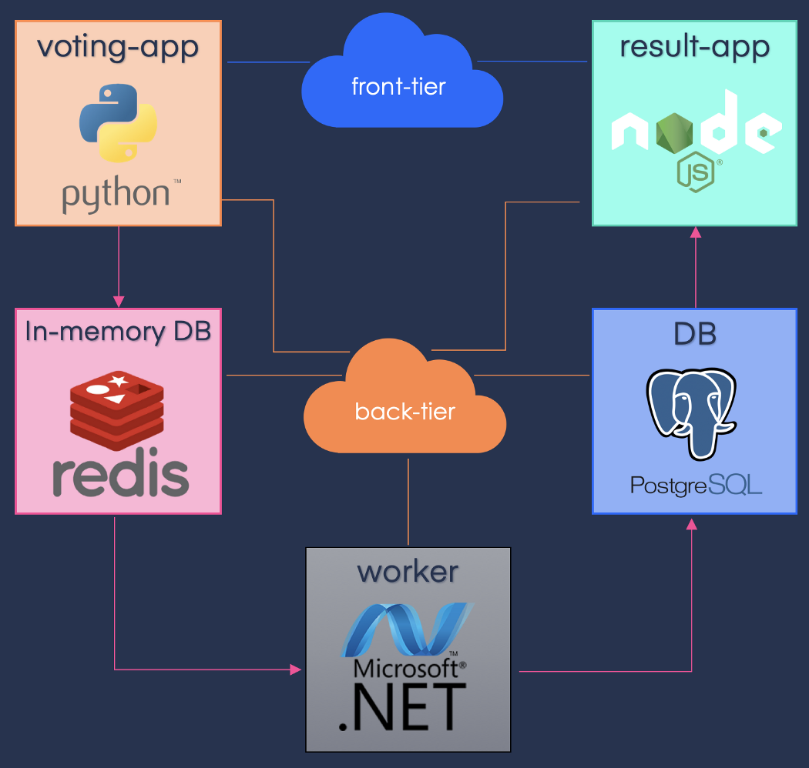
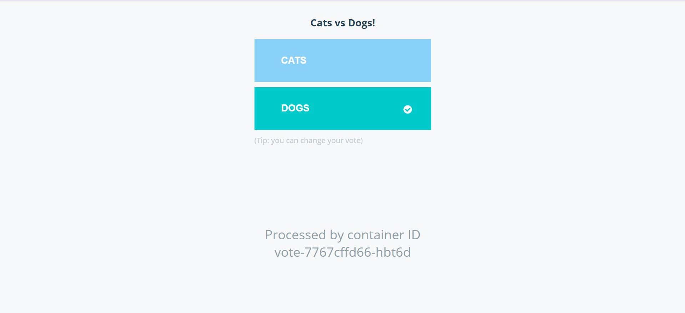
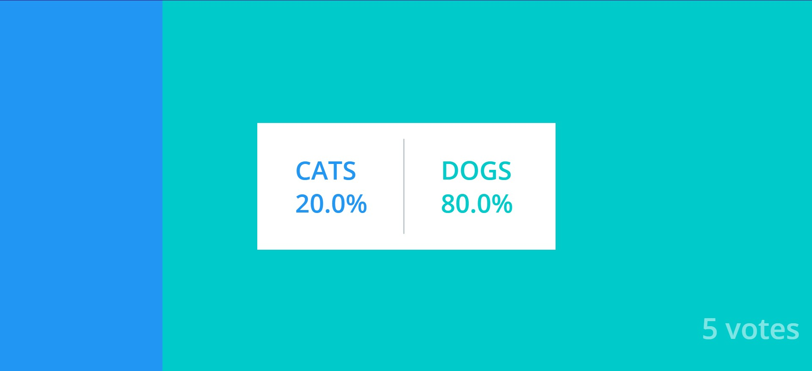

# Example Voting App
> This is a simple application based on micro-services architecture, consisting of 5 simple services. More information on how to deploy applications in the kubernetes cluster with Ingress controller is here https://youtu.be/tyj5pHOQpac and complete kubernetes playlist is here https://youtu.be/yBr92MCcQRc

## Working
- Voting-App: Frontend of the application written in Python, used by users to cast their votes.
- Redis: In-memory database, used as intermediate storage.
- Worker: .Net service, used to fetch votes from Redis and store in Postgres database.
- DB: PostgreSQL database, used as database.
- Result-App: Frontend of the application written in Node.js, displays the voting results.

> NOTE: The voting application only accepts one vote per client. It does not register votes if a vote has already been submitted from a client.

## Architecture



## Docker deployments

### .env file
Change the Parameters in the env file with your own docker account username and build tags
```
DOCKER_REPO=<your-docker-username>
BUILD_TAG=1.0.0
```
### Building the images
```
$ docker-compose -f docker-compose-build.yml build --no-cache
```
### Deploying the app
```
$ docker-compose up -d
```
### Access the application
The vote app will be running at [http://localhost:5000](http://localhost:5000), and the results will be at [http://localhost:5001](http://localhost:5001). Replace localhost with the IP of the host where applications are running in order to access it from other machines.

### Deploying in docker swarm
```
$ docker stack deploy -c docker-stack.yml vote
```

## Kubernetes deployment

- The vote and result are front-end so we need to access them from outside the cluster , so we need a NodePort service for each of them in order to access it from outside the cluster.
- For deploying in the cloud, We can change this NodePort service to LoadBalancer that provisions a Cloud LoadBalancer
- For the redis and postgresDB we need an clusterIP service because it's still inside the cluster.
